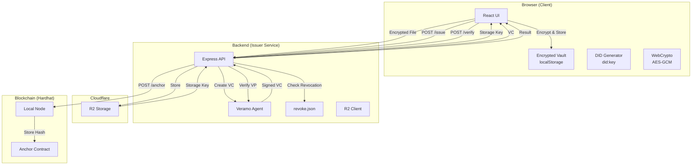

# Design Document

## Overview

The DID Credential Vault MVP is a three-tier application demonstrating decentralized identity and verifiable credential workflows. The system consists of:

1. **Client (React/Vite)**: Browser-based UI for holders and verifiers
2. **Issuer (Node.js/Express)**: Backend service for credential issuance and verification
3. **Blockchain (Hardhat)**: Local Ethereum network with credential anchoring contract

The architecture prioritizes simplicity and local development, using in-memory storage and did:key identifiers to eliminate external dependencies while maintaining W3C standards compliance.

## Architecture



## Components and Interfaces

### 1. Client Application (React/Vite)

#### Component Structure

**UploadAndCreateDid.jsx**
- Handles file encryption and upload to R2 via issuer
- Generates did:key identifier in browser
- Requests VC from issuer with file claims
- Stores received VC in encrypted vault

**Vault.jsx**
- Displays list of stored VCs (decrypted)
- Allows selection of VCs for presentation
- Creates and signs VP using holder's DID
- Exports VP for verification

**Verifier.jsx**
- Accepts VP input (paste or file upload)
- Submits VP to issuer /verify endpoint
- Displays verification results

#### Utility Modules

**cryptoVault.js**
```javascript
// Key functions:
- deriveKey(passphrase, salt) -> CryptoKey
- encryptVC(vc, passphrase) -> { encrypted, salt, iv }
- decryptVC(encrypted, passphrase, salt, iv) -> vc
- storeVC(vcId, encryptedData) -> void
- retrieveVCs(passphrase) -> VC[]
```

**r2Upload.js**
```javascript
// Key functions:
- encryptFile(file) -> { encrypted, key, iv }
- uploadToR2(encryptedFile) -> { storageKey, url }
- buildClaimsFromUpload(storageKey, docType) -> claims
```

**didManager.js**
```javascript
// Key functions:
- generateDidKey() -> { did, privateKey }
- storeDid(did, privateKey) -> void
- retrieveDid() -> { did, privateKey }
- signPresentation(vp, privateKey) -> signedVP
```

### 2. Issuer Service (Node.js/Express)

#### API Endpoints

**POST /upload**
- Accepts encrypted file from client
- Uploads to Cloudflare R2 using S3-compatible API
- Returns storage key and metadata
- Request: `multipart/form-data` with encrypted file
- Response: `{ storageKey, bucket, timestamp }`

**POST /issue**
- Accepts subject DID and claims
- Creates W3C Verifiable Credential using Veramo
- Signs with issuer's DID
- Returns signed VC
- Request: `{ subjectDid, claims: { storageKey, docType, ... } }`
- Response: `{ vc: {...} }`

**POST /verify**
- Accepts Verifiable Presentation
- Verifies cryptographic proofs via Veramo
- Checks revocation status
- Returns verification result
- Request: `{ vp: {...} }`
- Response: `{ verified: boolean, reason: string, details: {...} }`

**POST /anchor** (Optional)
- Accepts data hash
- Submits transaction to Anchor contract
- Returns transaction hash
- Request: `{ dataHash: "0x..." }`
- Response: `{ txHash: "0x...", blockNumber: number }`

#### Veramo Agent Configuration

**veramo-agent.js**
```javascript
// Agent setup:
- KeyManager with MemoryKeyStore
- DIDManager with KeyDIDProvider
- CredentialPlugin for W3C VC/VP
- No external resolvers (did:key is self-contained)
```

Key methods:
- `agent.didManagerCreate({ provider: 'did:key' })`
- `agent.createVerifiableCredential({ credential, proofFormat: 'jwt' })`
- `agent.verifyPresentation({ presentation })`

#### Revocation Registry

**revoke.json**
```json
{
  "revokedCredentials": [
    "urn:uuid:credential-id-1",
    "urn:uuid:credential-id-2"
  ],
  "lastUpdated": "2025-11-13T00:00:00Z"
}
```

#### R2 Integration

Uses AWS SDK v3 with S3-compatible configuration:
```javascript
const r2Client = new S3Client({
  region: 'auto',
  endpoint: process.env.R2_ENDPOINT,
  credentials: {
    accessKeyId: process.env.R2_ACCESS_KEY_ID,
    secretAccessKey: process.env.R2_SECRET_ACCESS_KEY
  }
});
```

### 3. Blockchain Module (Hardhat)

#### Anchor.sol Contract

```solidity
contract Anchor {
    mapping(bytes32 => bool) public anchors;
    event Anchored(bytes32 indexed hash, address indexed sender, uint256 timestamp);
    
    function anchor(bytes32 hash) public returns (bool) {
        require(!anchors[hash], "Already anchored");
        anchors[hash] = true;
        emit Anchored(hash, msg.sender, block.timestamp);
        return true;
    }
    
    function isAnchored(bytes32 hash) public view returns (bool) {
        return anchors[hash];
    }
}
```

#### Deployment

- Hardhat local network on default port 8545
- Deploy script creates Anchor contract
- Saves contract address to `deployed-address.json`
- Issuer service reads address for anchoring operations

## Data Models

### Verifiable Credential Structure

```json
{
  "@context": [
    "https://www.w3.org/2018/credentials/v1"
  ],
  "type": ["VerifiableCredential", "DocumentOwnershipCredential"],
  "issuer": {
    "id": "did:key:z6Mk..."
  },
  "issuanceDate": "2025-11-13T12:00:00Z",
  "credentialSubject": {
    "id": "did:key:z6Mk...",
    "storageKey": "encrypted-doc-abc123",
    "docType": "passport",
    "uploadTimestamp": "2025-11-13T11:59:00Z"
  },
  "proof": {
    "type": "JwtProof2020",
    "jwt": "eyJhbGc..."
  }
}
```

### Verifiable Presentation Structure

```json
{
  "@context": [
    "https://www.w3.org/2018/credentials/v1"
  ],
  "type": ["VerifiablePresentation"],
  "holder": "did:key:z6Mk...",
  "verifiableCredential": [
    { /* VC object */ }
  ],
  "proof": {
    "type": "JwtProof2020",
    "jwt": "eyJhbGc..."
  }
}
```

### Encrypted Vault Entry

```json
{
  "vcId": "urn:uuid:...",
  "encrypted": "base64-encrypted-data",
  "salt": "base64-salt",
  "iv": "base64-iv",
  "timestamp": "2025-11-13T12:00:00Z"
}
```

## Error Handling

### Client-Side Errors

1. **File Upload Failures**
   - Network errors: Retry with exponential backoff
   - R2 errors: Display error message from server
   - Encryption errors: Clear error message about browser compatibility

2. **DID Generation Failures**
   - Crypto API unavailable: Show browser compatibility warning
   - Storage failures: Prompt user to enable localStorage

3. **Vault Decryption Failures**
   - Wrong passphrase: Clear error message, allow retry
   - Corrupted data: Skip corrupted entries, log to console

4. **Verification Failures**
   - Invalid VP format: Show validation errors
   - Network errors: Display connection error

### Server-Side Errors

1. **R2 Upload Failures**
   - Return 500 with error details
   - Log full error for debugging
   - Don't expose R2 credentials in response

2. **VC Issuance Failures**
   - Invalid DID format: Return 400 with validation error
   - Veramo errors: Return 500 with sanitized error
   - Missing claims: Return 400 with required fields

3. **VP Verification Failures**
   - Invalid signature: Return `{ verified: false, reason: "Invalid signature" }`
   - Revoked credential: Return `{ verified: false, reason: "Credential revoked" }`
   - Expired credential: Return `{ verified: false, reason: "Credential expired" }`

4. **Blockchain Anchoring Failures**
   - Network not running: Return 503 with helpful message
   - Transaction failures: Return 500 with transaction error

## Testing Strategy

### Unit Tests

**Client**
- `cryptoVault.js`: Test encryption/decryption roundtrip
- `didManager.js`: Test DID generation and signing
- `r2Upload.js`: Test file encryption (mock R2 calls)

**Issuer**
- `veramo-agent.js`: Test VC creation and VP verification
- Revocation logic: Test revoke.json checking
- R2 client: Test upload with mocked S3 client

**Blockchain**
- `Anchor.sol`: Test anchor function and duplicate prevention
- Test event emission

### Integration Tests

1. **End-to-End Flow**
   - Upload file → Get storage key
   - Create DID → Request VC → Store in vault
   - Create VP → Verify VP
   - Verify revocation checking works

2. **API Contract Tests**
   - Test all endpoint request/response formats
   - Test error responses
   - Test CORS configuration

### Manual Testing Checklist

- [ ] File upload and R2 storage
- [ ] DID creation displays correctly
- [ ] VC request returns valid credential
- [ ] Vault encryption/decryption with passphrase
- [ ] VP creation includes selected VCs
- [ ] Verification returns correct results
- [ ] Revoked credentials fail verification
- [ ] Blockchain anchoring (when Hardhat running)

## Security Considerations

### MVP Limitations (Document for Production)

1. **Key Storage**
   - Current: Browser localStorage (unencrypted private keys)
   - Production: Hardware security module or secure enclave

2. **DID Method**
   - Current: did:key (ephemeral, not resolvable on-chain)
   - Production: did:ethr or did:web with proper resolution

3. **Credential Privacy**
   - Current: Full credential disclosure in VP
   - Production: BBS+ signatures for selective disclosure

4. **Revocation**
   - Current: Simple JSON file
   - Production: Status List 2021 or blockchain-based registry

5. **R2 Access**
   - Current: Server-side credentials
   - Production: Pre-signed URLs or client-side direct upload

6. **Passphrase Security**
   - Current: User-provided passphrase (no strength requirements)
   - Production: Key derivation with proper salt, PBKDF2 iterations

## Environment Configuration

### Client (.env)

```
VITE_ISSUER_API_URL=http://localhost:8080
```

### Issuer (.env)

```
PORT=8080
R2_ENDPOINT=https://<account-id>.r2.cloudflarestorage.com
R2_ACCESS_KEY_ID=<your-access-key>
R2_SECRET_ACCESS_KEY=<your-secret-key>
R2_BUCKET_NAME=did-vault-mvp
HARDHAT_NETWORK_URL=http://localhost:8545
ANCHOR_CONTRACT_ADDRESS=<deployed-address>
```

### Blockchain (.env)

```
# No environment variables needed for local development
```

## Development Workflow

1. **Start Hardhat Node**
   ```bash
   cd blockchain
   npx hardhat node
   ```

2. **Deploy Anchor Contract**
   ```bash
   npx hardhat run --network localhost scripts/deploy.js
   ```

3. **Start Issuer Service**
   ```bash
   cd issuer
   npm start
   ```

4. **Start Client**
   ```bash
   cd client
   npm run dev
   ```

5. **Access Application**
   - Open browser to `http://localhost:5173`
   - Follow demo flow in README

## Production Improvements Roadmap

### Phase 1: Security Hardening
- Implement proper key management (KMS or HSM)
- Add passphrase strength requirements
- Implement rate limiting on API endpoints
- Add request validation and sanitization

### Phase 2: DID Infrastructure
- Migrate to did:ethr with Ethereum mainnet/testnet
- Implement DID document resolution
- Add DID rotation capabilities

### Phase 3: Privacy Features
- Implement BBS+ signatures for selective disclosure
- Add zero-knowledge proof support
- Implement credential schemas

### Phase 4: Scalability
- Replace in-memory storage with PostgreSQL
- Implement proper revocation registry (Status List 2021)
- Add caching layer (Redis)
- Implement message queue for async operations

### Phase 5: User Experience
- Add mobile wallet support
- Implement QR code scanning for VP sharing
- Add credential templates
- Implement batch operations
